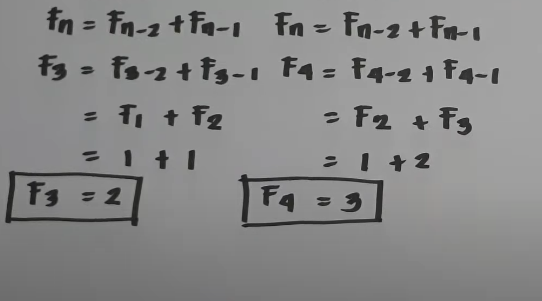

# Fibonacci Search

## Explanation
* Fibonacci Search is a comparison-based technigque that uses Fibonacci numbers to search an element in a sorted array
* It divides given array into unequal parts
* It uses + and - operator.
* It examines relatively closer elements in subsequent steps. So when the input array is big that cannot fit in CPU cache or even in RAM, Fibonacci Search can be useful

## Formula
* Fibonacci Numbers are recursively defined as F(n) = F(n-1) + F(n-2), F(0) = 0, F(1) = 1

## Algorithm

### Step 1
Find the smallest Fibonacci Number greather than or equal to n. Let this number be fibM[m'th Fibonacci Number].
Let the two Fibonacci numbers preceding it be fibMm [(m-1)m'th Fibonacci Number] and fibMm2 [(m-2)'th Fibonnaci Number]

### Step 2
While the array has elements to be inspected:
1. Comapre x with the last element of the range covered by fibMm2
2. If x matches, return index
3. Else if x is less than the element, move the three Fibonacci variables two Fibonnaci down, indicating elimination of approximately rear two-third of the remaining array
4. Else x greter than the element, move the three Fibonacci variables one Fibonacci down. Reset offset to index. Together these indicate the elimination of approximately front one-third of the remaining array

### Step 3
Since there might be a single element remaining for comparison, check if fibMm1 is 1. If Yes, compare x with that remaining element. If match, return index

