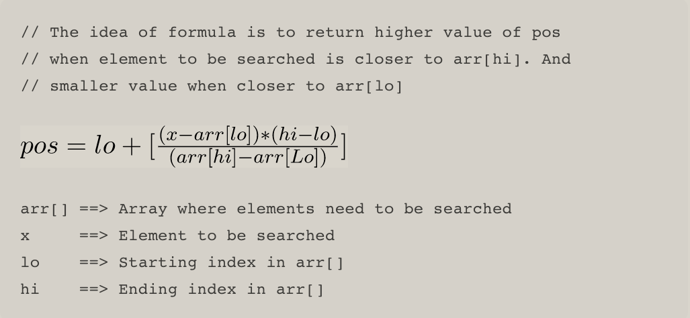
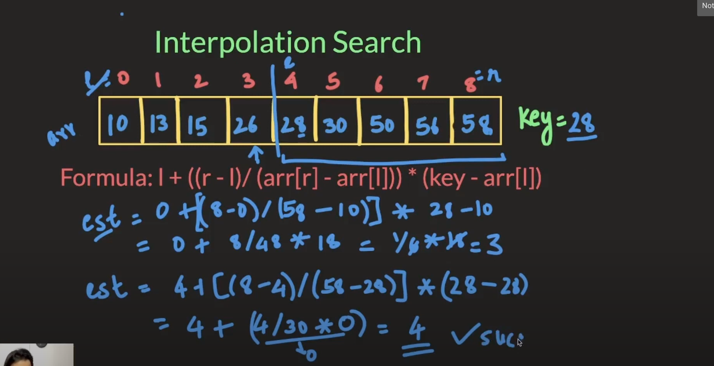

# Interpolation Search

## Explanation

* Interpolation search is an improvement over Binary Search
* Values of array are uniformly distributed
* Constrcuts new data points within the range of a discrete set of known data points.
* Go to different locations according to the value of the key being searched.

## Formula
* The ideia of the formula is to return higher value of position when the element to be searched is closer to the end of the array
* Or to return smaller value of the position when the element to be searched is closer to the beginning of the array.

### Formula with Solution
* [Video with explanation](https://www.youtube.com/watch?v=iMVKo1vXVsw)

## Algorithm

### Step 1
In a loop, calculate the value of "pos" using the probe position formula.

### Step 2
If it is a match, return the index of the item, and exit.

### Step 3
If the item is less than arr[pos], calculate the probe position of the left sub-array
Otherwise, calculate the same in the right sub-array
In the order words, if is less, create a new subarray with pos + 1 and rest.
If is high, create a new subarray with pos - 1 and rest.

### Step 4
Repeat until a match is found or the sub-array reduces to zero.
