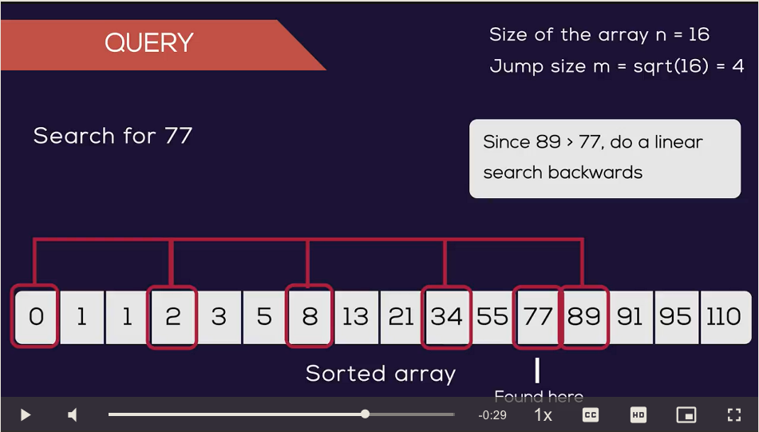

# Jump Search

## Explanation
* Jump search is a searching algorithm for sorted arrays
* The basic ideia is to check fewer elements (than linear search) by jumping ahead by ficed steps or
* skipping some elements in place of searching all elements.

## Illustration

## Algorithm

### Context
* Let's consider the following array: (0, 1, 1, 2, 3, 5, 8, 13, 21, 34, 55, 89, 144, 233, 377, 610)
* The length of the array is 16
* The Jump Search will find the value of 55 with the following steps assuming that the block size to be jumped is 4.

### Step 1
Jump frpm 0 to index 4

### Step 2
Jump from index 4 to index 8

### Step 3
Jump from inde x 8 to index 12

### Step 4
Since the element at index 12 is greather than 55, we will jump back a step to come to index 8

### Step 5
Perform a linear search from index 8 to get the element 55.
