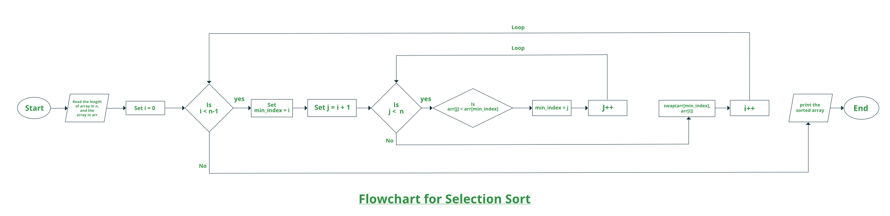

# Selection Sort

## Explanation
* It sorts an array by repeatedly finding the minimum or maximum element from unsorted part and putting it at the beginning
* It maintains two subarrays in a given array
  * The subarray which is already sorted
  * Remaining subarray which is unsorted
* In every iteration of selection sort, the minimum or maximum element from the unsorted subarray is picked and moved to the sorted subarray

## Formula
<a href="https://media.geeksforgeeks.org/wp-content/cdn-uploads/20220203094305/Selection-Sort-Flowhchart.png" target="_blank">
  </img>
</a>

## Algorithm

### Step 1
Initialize minimum value(min_idx) to location 0

### Step 2
Traverse the array to find the minimum element in the array

### Step 3
While traversing if any element smaller than min_idx is found then swap both the values

### Step 4
Then, increment min_idx to point to next element

### Step 5
Repeat until array is sorted
