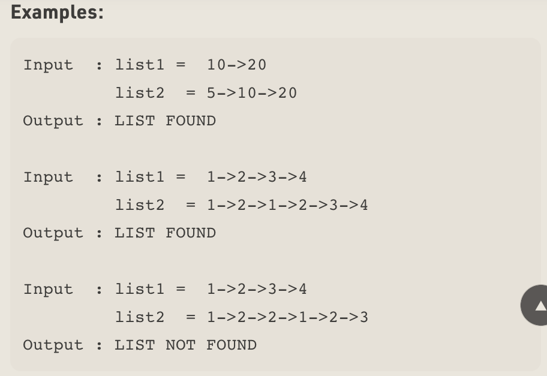

# Sublist Search

## Explanation
* Given two linked lists, the task is to check whether the first list is present in 2nd list or not.

## Images

## Algorithm

### Step 1
Take first node of second list

### Step 2
Start matching the first list from the first node

### Step 3
If whole list match return true

### Step 4
Else break and take first list to the first node again
